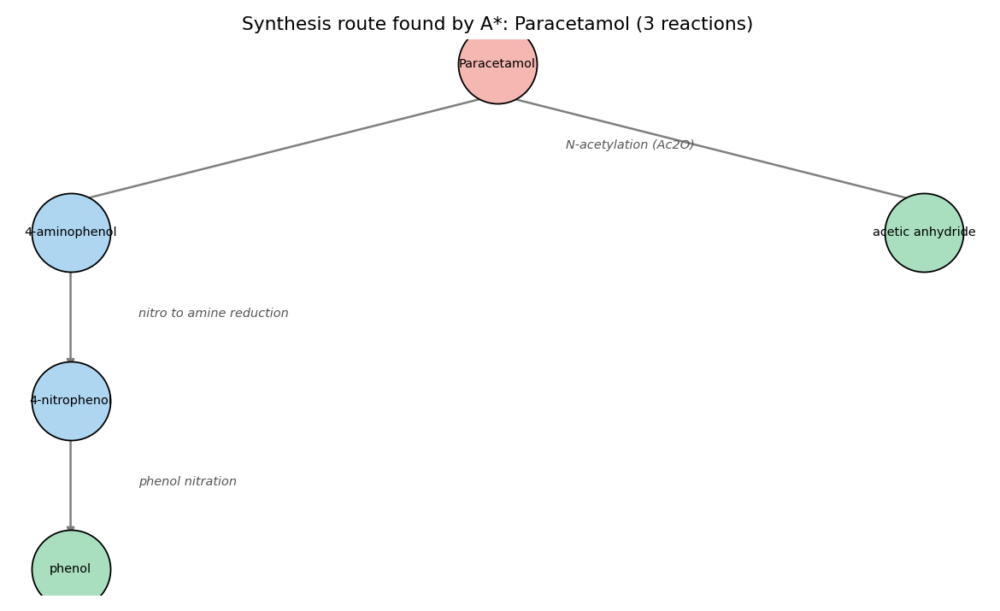
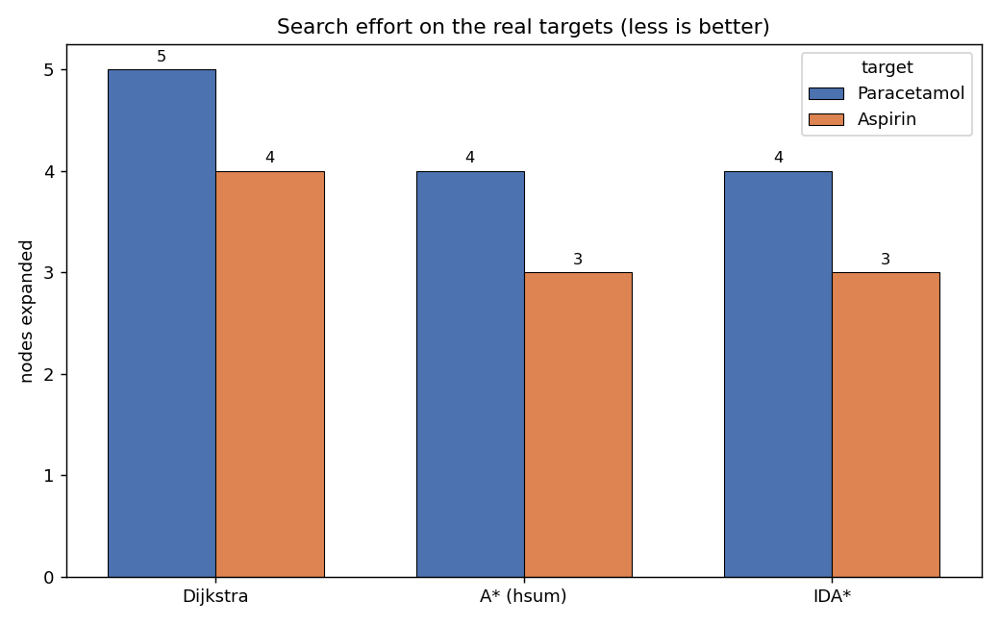
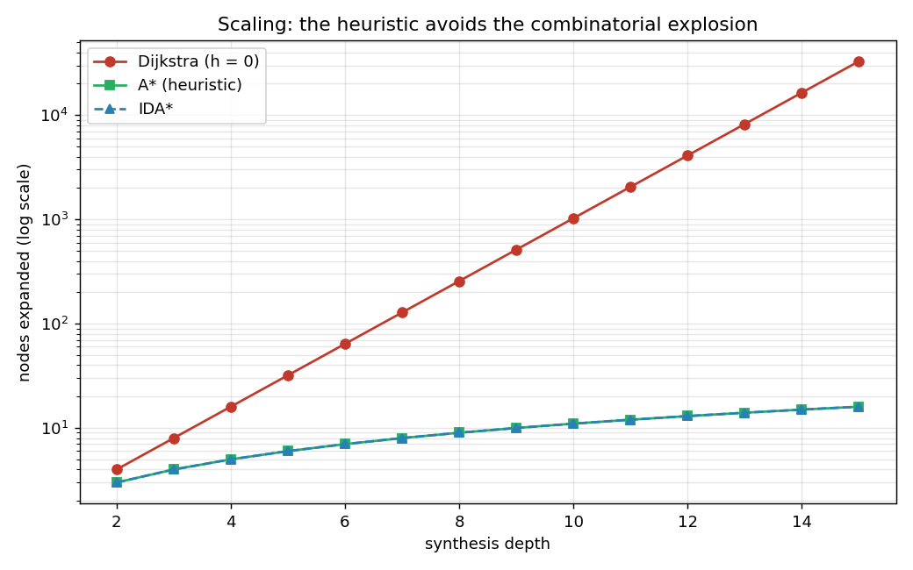

# Heuristic search applied to retrosynthesis

Applying classic state-space search algorithms (Dijkstra, A\*, IDA\*) to a real
problem: planning the synthesis of a drug molecule.

## The problem

Doing the retrosynthesis of a molecule means starting from the target molecule
(a drug) and working backwards, reaction by reaction, until you reach simple
molecules that can be bought off the shelf. This is backward-chaining planning.

The mapping to a classic search is direct:

* a state is the set of molecules still left to make;
* the start state is the target molecule alone;
* the goal is the empty set (everything has become available);
* an action is a chemical reaction run in reverse (a disconnection);
* a solution is the sequence of reactions, i.e. the synthesis route.

Molecules are written in SMILES, the standard format (ethanol is `CCO`, benzene
`c1ccccc1`, paracetamol `CC(=O)Nc1ccc(O)cc1`). A molecule is therefore just a
string, which makes states very easy to handle.

## The heuristic

To guide the search I first compute, for each molecule, its "level", i.e. the
minimum number of reactions to make it from the catalog. The computation is a
fixed point: the catalog is at 0, and each molecule takes the best reaction that
produces it. This is the level-cost idea from Graphplan.

From these levels I provide several heuristics, increasingly strong:

* `h0` is 0, so A\* falls back to Dijkstra;
* `h1` counts the molecules left;
* `hmax` takes the largest level, it is admissible;
* `hsum` takes the sum of the levels, admissible here because the subgoals are
  independent, and it is the most efficient.

A molecule that cannot be made has an infinite level, hence an infinite
heuristic. The branch is then cut off right away. That is what removes the
synthesis dead ends.

## The algorithms

Everything is in `search.py`, which knows nothing about chemistry (we just pass
it a problem). It contains Dijkstra, A\* with its open and closed lists, and
IDA\* with its threshold on f = g + h.

## What we get

Two real targets, paracetamol and aspirin, with their classic syntheses.

The route found by A\* for paracetamol (3 reactions):



The same kind of result for aspirin (2 reactions) is in `figures/tree_aspirin.png`.

On these real targets, A\* and IDA\* expand slightly fewer nodes than Dijkstra:
the node saved is exactly the dead end, cut off by the heuristic.



The gap stays small here because the search is short. To really see what the
heuristic buys you, I added a test where the synthesis depth grows, with a single
good route and many wrong turns. There Dijkstra explores the whole tree (2 to the
power d) while A\* and IDA\* go straight to the goal (d reactions). On a log
scale, Dijkstra is a straight line, the other two stay flat.



That is the whole point of a good admissible heuristic: the same optimal result,
but without the combinatorial explosion.

## How to run

With Python 3.11:

```
python main.py        text demo (routes + comparison)
python tests.py       check optimality and admissibility
python figures.py     generate the images in figures/
python benchmark.py   the scaling table
```

No required dependency for the core of the project. The images use matplotlib.
If RDKit is installed (`conda install -c conda-forge rdkit`), the program also
checks that every SMILES is a real molecule and prints its molecular formula.

## The files

* `search.py` : Dijkstra, A\* and IDA\*, independent of the domain
* `reactions.py` : the catalog and the reactions (the chemistry)
* `retro_problem.py` : the retrosynthesis problem and the heuristics
* `benchmark.py` : the scaling test
* `figures.py` : generation of the plots and trees
* `main.py` : the demo
* `tests.py` : the checks
